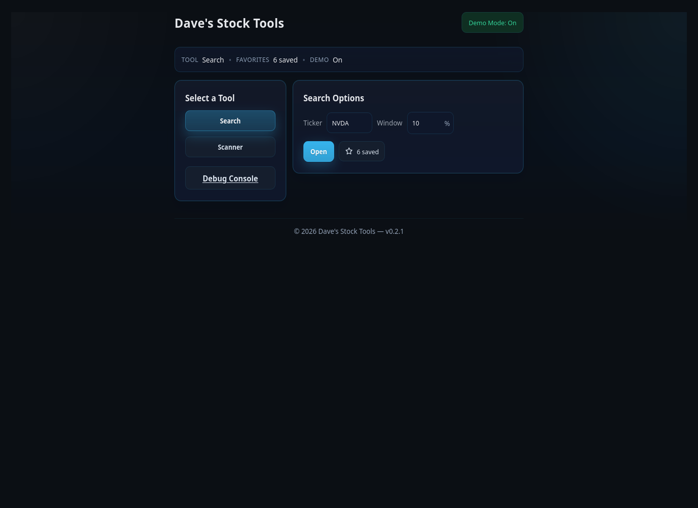
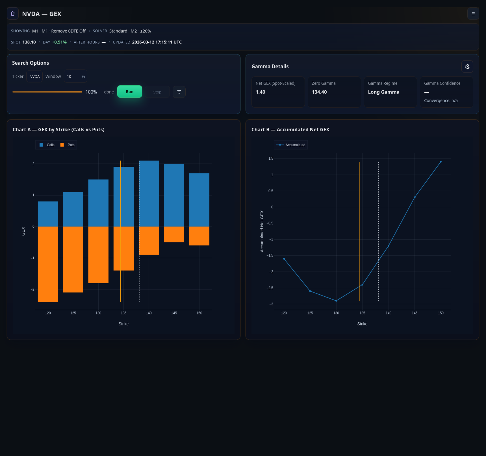
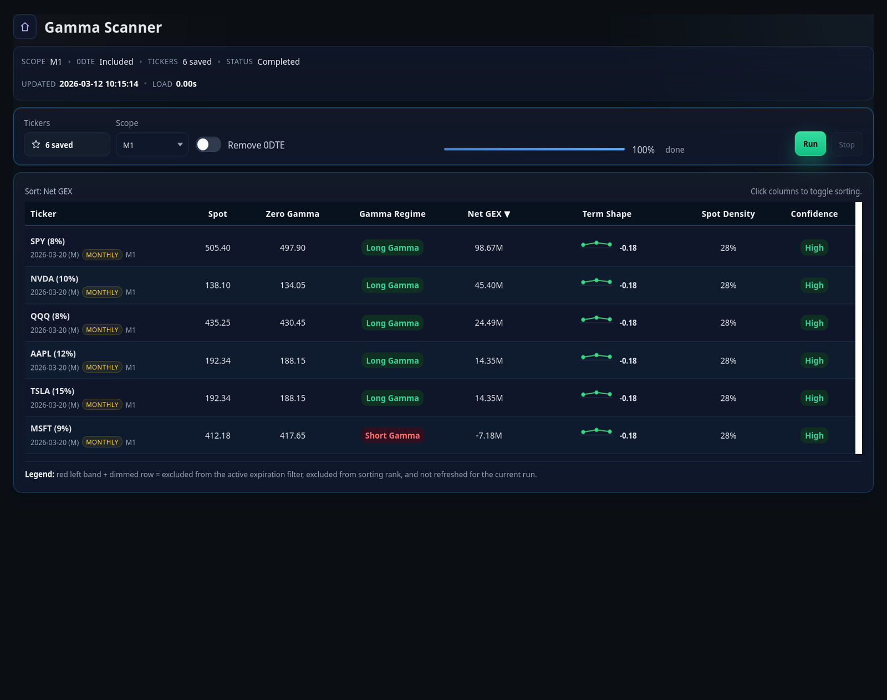
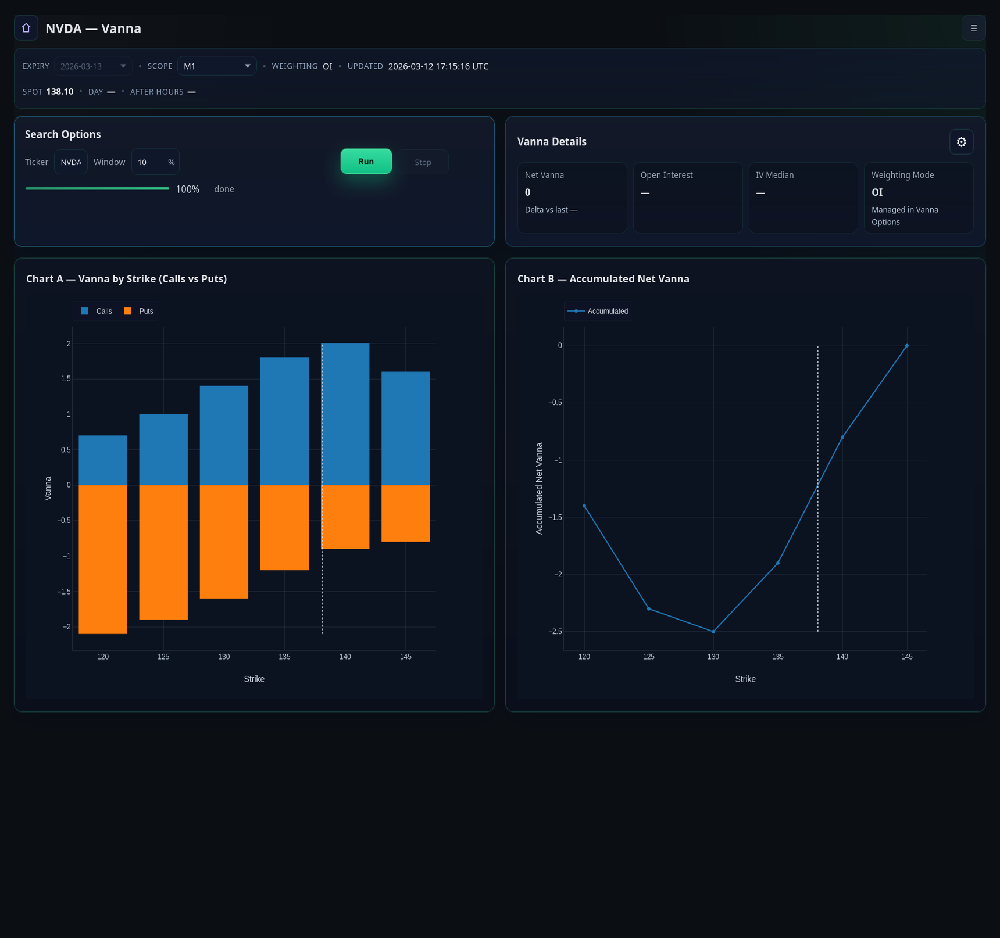

# Dave's Stock Tools

FastAPI application for local options-flow analysis across three workflows:

- `GEX / Zero Gamma` ticker analysis with spot-space zero-gamma solving and strike-space charts
- `Gamma Scanner` for multi-ticker net GEX and regime monitoring
- `Vanna Ticker` for strike-by-strike vanna profiles and cumulative context

**NOT Investment Advice** for using this tool at your own discretion.

## Main Features

`v0.2.1` is the current release target. It builds on `v0.2.0` by finishing the shared expiration-scope model across GEX, scanner, Vanna, and demo mode, while tightening expiry metadata, cache semantics, and screenshot-ready UI states.

## What's New In v0.2.1

- Added a shared expiration-scope model for `Selected`, `0DTE`, `1DTE`, `Weekly`, `Monthly`, `M1`, `M2`, and `All` flows, including support detection and exact included-expiration metadata.
- Expanded the Gamma Scanner with a context strip, W1/M1/M2 term-shape analytics, spot-density scoring, excluded-row handling, and monthly-expiry tagging.
- Unified GEX and Vanna expiry controls so page scope, selected expiry, and debug details reflect the same resolved expiration set.
- Hardened GEX request and cache semantics by resolving the effective expiry universe before cache lookup, job launch, demo payload generation, and solver preview.
- Improved expiry discovery with guarded pagination, partial-result cache protection, and richer `/api/expiries` metadata for the frontend.
- Refreshed demo payloads, screenshots, and regression coverage so repository docs match the current UI and scope logic.

## Main Capabilities

### GEX / Zero Gamma

- Strike-space GEX charts for calls, puts, and accumulated net GEX
- Spot-space Zero Gamma solving with configurable horizons, strike bands, tail handling, and refinement modes
- Scope-aware chart filters for selected expiry, 0DTE, 1DTE, weekly, monthly, M1, M2, and full aggregate views
- Gamma Regime and solver-confidence context for parity/debugging work
- Export helpers for TradingView pairs and Pine snippets

### Gamma Scanner

- Watchlist scanning across 0DTE, 1DTE, weekly, monthly, M1, M2, or aggregate expiry scopes
- Per-ticker windows, 0DTE removal toggle, term-shape and spot-density signals, sortable results, and direct drill-down into the GEX ticker
- Shared zero-gamma math and scope resolution with the single-ticker GEX page so scanner and ticker stay aligned

### Vanna Ticker

- Per-strike and cumulative vanna charts
- Weighting controls, shared expiry/scope controls, spot overrides, and full diagnostic details
- Same job-management and demo-mode workflow as the gamma pages

## Screenshots

All screenshots below are captured in demo mode with bundled sample data.

### Home Screenshot



### GEX Ticker Screenshot



### Gamma Scanner Screenshot



### Vanna Ticker Screenshot



## Architecture

The `v0.2.1` release extends the `v0.2.0` architecture pass with a shared expiration-scope model, richer expiry metadata, and stronger scanner diagnostics.

The full engineering overview lives in [docs/ARCHITECTURE.md](docs/ARCHITECTURE.md).

## Demo Mode

Demo mode is intended for screenshots, onboarding, and drive-by repo inspection.

- Set `DEMO_MODE=1` in `.env` to use bundled sample payloads without any API keys.
- The home page also exposes a Demo Mode toggle that persists in a cookie.
- Demo mode now returns synthetic expiry lists as well, so GEX and Vanna pages load like a realistic first-run experience.
- The screenshots in this README represent demo-mode data, not live market output.

## Running Locally

```bash
python3 -m venv .venv
source .venv/bin/activate
pip install -r requirements-dev.txt
cp .env.example .env

# Demo mode
uvicorn app:app --reload --host 0.0.0.0 --port 8000
```

For live data, set `DEMO_MODE=0` and provide `MASSIVE_API_KEY`. `POLYGON_API_KEY` is still accepted as a compatibility alias for older local setups.

## Main Pages

- `/` home page for mode selection, favorites, and demo-mode toggling
- `/gexticker/{symbol}` GEX / Zero Gamma analysis
- `/scanner` multi-ticker gamma scanner
- `/ticker/{symbol}` Vanna analysis
- `/debug` unified debug console
- `/events/{symbol}` and `/econ` supporting event/news pages

## Diagnostics And Transparency

`v0.2.1` extends the debugging surfaces so results can be inspected instead of trusted blindly.

- GEX exposes solver previews, confidence labels, resolved-expiration context, monthly-expiry metadata, and a full-details panel.
- Vanna exposes its active query state, scope support, and copyable debug JSON.
- Scanner rows inherit the same gamma regime and confidence framing used by the single-ticker views while adding term-shape anchors, spot density, and exclusion context.
- Cache keys now track the solver profile, resolved expiry filters, 0DTE handling, and calc-version inputs so old payloads do not masquerade as current results.

## Data And Model Assumptions

- Zero Gamma is solved in spot space from total signed gamma as a function of spot. It is intentionally not the same thing as the older static strike-flip approximations.
- `Net GEX (Spot-Scaled)` is the headline page metric. The solver still works from raw signed gamma internally, and the UI now makes that distinction explicit.
- Provider IV/OI freshness, expiry filtering, and vendor-specific weighting differences can still create drift versus external dashboards.
- Runtime state is in-memory. Multi-process or hosted deployments would need a shared cache/job backend.

## Quality

- Tests: `.venv/bin/python -m pytest -q`
- Lint: `.venv/bin/python -m ruff check .`
- Format: `.venv/bin/python -m black .`

Shared tooling config lives in `pyproject.toml`.

## Release Context

- Current release target: `v0.2.1`
- Last GitHub release/tag baseline: `v0.2.0`
- Full release notes: `RELEASE_NOTES.md`
- Detailed changelog: `CHANGELOG.md`

## License

MIT. See `LICENSE`.
